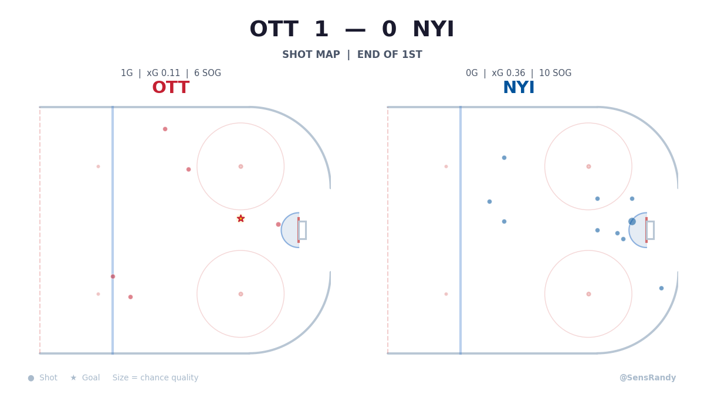

# NHL Expected Goals (xG) Model

A machine learning model that predicts the probability of any NHL shot becoming a goal. Trained on **2,066,537 shots across 19 seasons (2007-2025)** of NHL data.

Built by [@SensRandy](https://twitter.com/SensRandy) | Analytics by [@Nhl_Historian](https://twitter.com/Nhl_Historian)

---

## What is xG?

Every shot in hockey has a different probability of going in. A breakaway from 10 feet out might be a 35% chance. A point shot from the blue line through traffic might be 2%.

Our model assigns that probability — called **expected goals (xG)** — to every single shot based on 52 features.

**Why it matters:** If a team generates 3.5 xG but only scores 1 goal, they were unlucky. They created enough quality chances to deserve 3-4 goals. xG tells you more about team quality than the scoreboard does.

<p align="center">
  
  <br>
  <em>Shot map from a Sens game — dot size = chance quality, stars = goals</em>
</p>

---

## Model Performance

| Metric | Value | Meaning |
|--------|-------|---------|
| **AUC** | 0.786 | Model correctly ranks a goal above a non-goal ~79% of the time |
| **Brier Score** | 0.056 | Predicted probabilities are well-calibrated to actual outcomes |
| **Training Data** | 2,066,537 shots | 19 NHL seasons (2007-2025) |
| **Features** | 52 | Shot location, context, game state, player talent, goalie quality |

Cross-validated across 5 folds with a standard deviation of just 0.0004 — extremely stable.

This performance matches published benchmarks from [MoneyPuck](https://moneypuck.com/) and other public xG models. The theoretical ceiling without player tracking data is approximately 0.80-0.81 AUC.

---

## How It Works

### Algorithm

**CatBoost** — a gradient-boosted decision tree algorithm. It processes each shot through 1,500 decision trees, each one learning from the mistakes of the previous ones. The final prediction is the combined output of all trees.

### Features (What the Model Sees)

The model evaluates 52 features for every shot, grouped into categories:

#### Shot Location (6 features)
Where the shot came from — distance and angle to the net, adjusted for arena reporting bias (different arenas record shot coordinates slightly differently).

> Shots from within 20 feet score ~15% of the time. Shots from 50+ feet score ~2%.

#### Shot Type (1 feature)
Wrist, slap, snap, backhand, tip-in, wrap-around, or deflection. Each has a different baseline goal rate.

> Deflections and tip-ins are the most dangerous shot types. Wrist shots are the most common.

#### Shot Context (6 features)
- **Rebound** — Was this a second-chance shot off a save? Rebounds score at 10.9% vs the 6.7% baseline.
- **Rush** — Was this off a transition play? Rush chances are higher quality.
- **Empty net** — Is the goalie pulled?
- **Off-wing** — Is the shooter on their off-wing? Creates different angles for one-timers.

#### Game State (7 features)
How many skaters are on the ice for each team (5v5, power play, shorthanded), period, home/away, regular season vs playoffs.

> Power play shots convert at roughly double the 5v5 rate due to increased time, space, and shooting lanes.

#### Score State (2 features + 2 engineered)
Whether the shooting team is leading, trailing, or tied — plus the exact score differential.

> Trailing teams take more desperate, higher-quality shots. Leading teams play more conservatively.

#### Last Event Context (6 features)
What happened immediately before the shot — the distance, angle, speed, and type of the previous event.

> A shot immediately after a turnover in the slot is very different from one after a 30-second cycle along the boards.

#### Fatigue (8 features)
How long the shooter has been on the ice this shift, how long since the last whistle, average shift length for both teams, and rest differential.

> Players late in a shift are slower to release and less accurate. Fresh legs generate better chances.

#### Player Identity (2 features)
Position (center, left wing, right wing, defenseman) and shooting hand (left/right).

> Defensemen take the majority of shots from distance. Forwards generate most high-danger chances.

#### Engineered Features (12 features)

We built 12 additional features on top of the raw data. Three are novel features based on hockey domain knowledge — these are the ones that meaningfully improve the model. The other 9 are standard derivations (score differential, power play flags, fatigue ratios, etc.) that reformat existing columns into forms the model can use more effectively.

**Novel features:**

1. **Zone Danger** — We divided the ice surface into a grid and computed the historical goal rate from each zone across 2M+ shots. This captures spatial patterns that raw distance/angle miss — like the fact that shots from the left hash marks convert differently than shots from the right circle at the same distance. **This is our single most important feature (17.8% of model importance).**

2. **Shooter Talent** — Each shooter's historical shooting percentage relative to the league average, with statistical shrinkage for small sample sizes. Elite shooters like Alex Ovechkin get a positive adjustment. A 4th-liner with limited data gets pulled toward the league average.

3. **Goalie Quality** — Each goalie's historical save percentage relative to the league average. Facing a Vezina-caliber goalie vs. an AHL callup significantly affects goal probability.

**Standard derivations (9 features):**

These are straightforward transformations that any hockey model would include — score differential from the shooter's perspective, power play / shorthanded flags, time remaining in the period, shift length ratios, and distance-angle interactions. They collectively account for about 5% of model importance. We don't list them individually because they aren't novel — they're table stakes for an xG model.

---

## Feature Importance

The top 10 features account for ~70% of what the model learns:

```
Zone Danger .......................... 17.8%
Shot Distance ........................ 10.7%
Arena-Adjusted Distance .............. 8.3%
Shot Type ............................ 7.4%
Time Since Last Event ................ 5.5%
Goalie Quality ....................... 4.9%
Shooter Talent ....................... 4.7%
Lateral Position (Y) ................. 4.3%
Offensive Zone Depth (X) ............. 3.6%
Shot Angle ........................... 2.9%
```

The remaining 42 features contribute the other ~30% — each individually small but collectively meaningful.

---

## Training Process

1. **Data Collection** — 19 seasons of shot-level data from MoneyPuck (2007-2025), totaling 2,066,537 shots and 139,272 goals (6.74% goal rate).

2. **Feature Engineering** — 40 features selected from the raw data + 12 custom features engineered from hockey domain knowledge.

3. **Cross-Validation** — 5-fold stratified cross-validation. The model trains on ~1.65M shots and validates on ~413K shots per fold, repeated 5 times. No fold ever sees its own validation data during training.

4. **Final Model** — After validation, a final model is trained on all 2M+ shots for production use.

5. **Leakage Detection** — During development, we discovered and removed a feature (`shotGeneratedRebound`) that was encoding the target variable. A shot that "generated a rebound" was by definition saved — 0 goals out of 8,534 shots. This kind of subtle leakage inflates performance metrics dishonestly. We removed it for an honest model.

---

## Applications

This model powers the analytics content on [@SensRandy](https://twitter.com/SensRandy) and [@Nhl_Historian](https://twitter.com/Nhl_Historian):

- **Shot Maps** — Visual display of every shot in a game, sized by goal probability
- **xG Flow Charts** — Cumulative expected goals over game time, showing which team dominated
- **Post-Game Verdicts** — "Did the team deserve to win?" based on chance quality
- **Player Analysis** — Who's over/underperforming their expected output?

---

## Limitations

- **No tracking data** — We don't have access to player/puck speed, goalie positioning, or screening information. This data exists within the NHL but isn't publicly available.
- **No pre-shot passing** — Cross-ice passes and one-timers dramatically increase goal probability but aren't fully captured in the feature set.
- **Historical bias** — The game has changed over 19 seasons (rule changes, equipment, goaltending technique). Older seasons may not perfectly represent modern hockey.
- **Publicly available data only** — We use the same MoneyPuck data that's available to anyone. NHL teams with proprietary data can build meaningfully better models.

---

## Context: How Does This Compare?

| Model | AUC | Data |
|-------|-----|------|
| Random guess | 0.500 | — |
| Shot distance only | ~0.680 | 1 feature |
| **This model** | **0.786** | **52 features, 2M shots** |
| MoneyPuck (industry standard) | ~0.78-0.80 | 124 features |
| Theoretical ceiling (public data) | ~0.80-0.81 | Would need tracking data to go higher |

---

## Tech Stack

- **Model**: CatBoost gradient-boosted classifier
- **Data**: MoneyPuck shot-level CSVs (2007-2025)
- **Live Scoring**: NHL API play-by-play → real-time xG per shot
- **Visualization**: Matplotlib (shot maps, xG flow charts)
- **Infrastructure**: AWS

---

## Contact

- Twitter: [@SensRandy](https://twitter.com/SensRandy) (Ottawa Senators analytics)
- Twitter: [@Nhl_Historian](https://twitter.com/Nhl_Historian) (Daily NHL history)

Built with data from [MoneyPuck.com](https://moneypuck.com/) and the [NHL API](https://api-web.nhle.com/).
